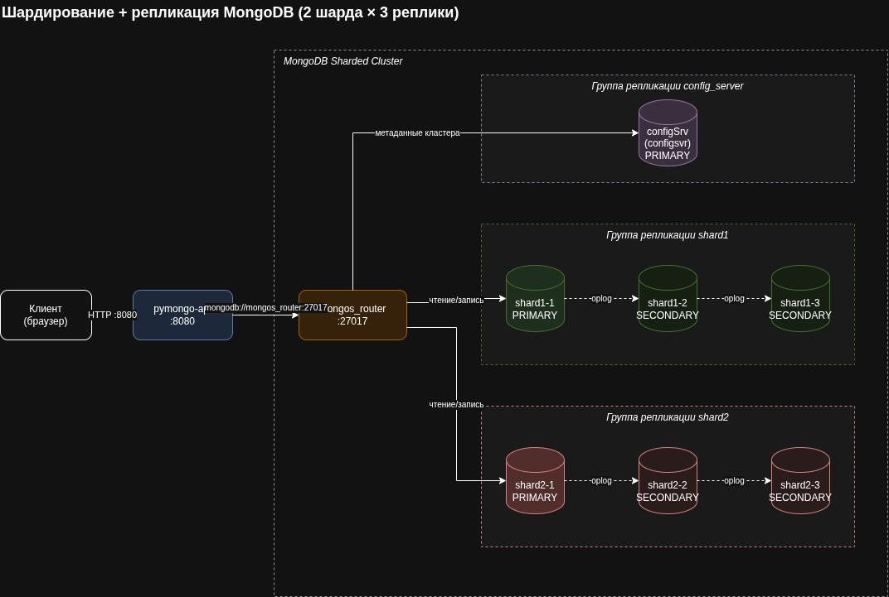

# pymongo-api + MongoDB Sharding & Replication

Второй вариант целевой схемы: к шардированию из `mongo-sharding` добавлена репликация.
Каждый шард — это группа репликации из трёх узлов:
при отказе PRIMARY остальные реплики выбирают нового и шард продолжает работать.

Схема: [mongo-sharding-repl.drawio](./mongo-sharding-repl.drawio)



## Состав сервисов

| Сервис | Тип | Группа репликации | Назначение |
|---|---|---|---|
| `pymongo_api` | приложение (FastAPI) | — | HTTP API, порт `8080` |
| `mongos_router` | mongos | — | точка входа в кластер, порт `27017` |
| `configSrv` | configsvr | `config_server` | метаданные кластера и карта чанков |
| `shard1-1` | shardsvr | `shard1` | шард 1, реплика 1 |
| `shard1-2` | shardsvr | `shard1` | шард 1, реплика 2 |
| `shard1-3` | shardsvr | `shard1` | шард 1, реплика 3 |
| `shard2-1` | shardsvr | `shard2` | шард 2, реплика 1 |
| `shard2-2` | shardsvr | `shard2` | шард 2, реплика 2 |
| `shard2-3` | shardsvr | `shard2` | шард 2, реплика 3 |

Приложение подключается только к `mongos_router` и ничего не знает ни о шардах,
ни о том, какой узел внутри шарда сейчас PRIMARY.

## Как запустить

```shell
docker compose up -d
```

## Настройка репликации и шардирования

Для настройки выполните шаги, описанные ниже.
Как альтернатива можно настроить и наполнить кластер одним скриптом:

```shell
./scripts/mongo-init.sh
```

Важно: `mongod` внутри контейнера поднимается не мгновенно. Перед шагом 1 проверьте
состояние сервисов:

```shell
docker compose ps
```

Дождитесь, пока `healthy` станут `configSrv` и все шесть узлов шардов.

А `mongos_router` на этом этапе будет в состоянии `health: starting`, а затем
`unhealthy` — и это нормально. `mongos` не начинает принимать подключения, пока не
прочитает метаданные из config-реплики, а она инициализируется только на шаге 1.
Healthy он станет сам после шага 1, ждать его заранее не нужно. По этой же причине в
его логах повторяется `Error loading global settings from config server` в контексте
`mongosMain` — эти сообщения прекратятся, как только выполните шаг 1.

### 1. Инициализируем replica set config-сервера

```shell
docker compose exec -T configSrv mongosh --port 27017 --quiet <<'EOF'
rs.initiate({
  _id: "config_server",
  configsvr: true,
  members: [
    { _id: 0, host: "configSrv:27017" }
  ]
});
EOF
```

### 2. Инициализируем группу репликации шарда 1

Команда выполняется **один раз** — на любом узле группы. Он разошлёт конфигурацию
остальным, отдельно настраивать `shard1-2` и `shard1-3` не нужно.

```shell
docker compose exec -T shard1-1 mongosh --port 27017 --quiet <<'EOF'
rs.initiate({
  _id: "shard1",
  members: [
    { _id: 0, host: "shard1-1:27017" },
    { _id: 1, host: "shard1-2:27017" },
    { _id: 2, host: "shard1-3:27017" }
  ]
});
EOF
```

### 3. Инициализируем группу репликации шарда 2

```shell
docker compose exec -T shard2-1 mongosh --port 27017 --quiet <<'EOF'
rs.initiate({
  _id: "shard2",
  members: [
    { _id: 0, host: "shard2-1:27017" },
    { _id: 1, host: "shard2-2:27017" },
    { _id: 2, host: "shard2-3:27017" }
  ]
});
EOF
```

Поле `_id` нумерует члена **внутри своей** группы репликации, поэтому в каждой группе
нумерация начинается с 0. В кластере шард идентифицируется именем группы —
`shard1` / `shard2`.

### 4. Дожидаемся выборов PRIMARY

Перед добавлением шардов в каждой группе должен быть выбран PRIMARY, иначе `mongos`
не сможет добавить шард. Проверьте, что PRIMARY появился в обеих группах:

```shell
docker compose exec -T shard1-1 mongosh --port 27017 --quiet --eval \
  'rs.status().members.forEach((m) => print(m.name + " -> " + m.stateStr))'
docker compose exec -T shard2-1 mongosh --port 27017 --quiet --eval \
  'rs.status().members.forEach((m) => print(m.name + " -> " + m.stateStr))'
```

Ожидаемый вывод — один `PRIMARY` и два `SECONDARY` в каждой группе. Выборы занимают
несколько секунд. Обратите внимание: PRIMARY может стать **любой** узел группы, не
обязательно тот, на котором выполнялся `rs.initiate`.

### 5. Добавляем шарды в кластер (на `mongos_router`)

В строке подключения перечисляем все реплики группы, чтобы `mongos` мог продолжать
работу с шардом при отказе любого отдельного узла:

```shell
docker compose exec -T mongos_router mongosh --port 27017 --quiet <<'EOF'
sh.addShard("shard1/shard1-1:27017,shard1-2:27017,shard1-3:27017");
sh.addShard("shard2/shard2-1:27017,shard2-2:27017,shard2-3:27017");
EOF
```

### 6. Включаем шардирование БД и коллекции

```shell
docker compose exec -T mongos_router mongosh --port 27017 --quiet <<'EOF'
sh.enableSharding("somedb");
sh.shardCollection("somedb.helloDoc", { name: "hashed" });
EOF
```

Ключ шардирования — хеш от `name`: документы распределяются по шардам равномерно.

При повторном выполнении шагов 1–3 MongoDB ответит `MongoServerError[AlreadyInitialized]:
already initialized`, а шаг 5 — ошибкой о дубликате шарда. Это нормально: значит кластер
уже собран, и эти шаги нужно просто пропустить.

### 7. Наполняем данными

```shell
docker compose exec -T mongos_router mongosh --port 27017 --quiet <<'EOF'
use somedb
for (var i = 0; i < 1000; i++) db.helloDoc.insertOne({ age: i, name: "ly" + i });
print("Всего документов: " + db.helloDoc.countDocuments());
EOF
```

## Как проверить

### Общее количество документов и количество реплик

```shell
curl -s http://localhost:8080/ | jq
```

В ответе должно быть `"mongo_topology_type": "Sharded"`, `"documents_count": 1000`
и список шардов, где у каждого перечислены все три реплики:

```json
"shards": {
  "shard1": "shard1/shard1-1:27017,shard1-2:27017,shard1-3:27017",
  "shard2": "shard2/shard2-1:27017,shard2-2:27017,shard2-3:27017"
}
```

### Количество документов в каждом из шардов

```shell
docker compose exec -T mongos_router mongosh --port 27017 --quiet <<'EOF'
use somedb
db.helloDoc.getShardDistribution();
EOF
```

### Состав каждой группы репликации

```shell
for s in shard1-1 shard2-1; do
  docker compose exec -T $s mongosh --port 27017 --quiet --eval \
    'print("replSet: " + rs.status().set); rs.status().members.forEach((m) => print("   " + m.name + " -> " + m.stateStr))'
done
```

### Данные действительно реплицированы

Каждый узел группы должен показать одинаковое число документов:

```shell
for s in shard1-1 shard1-2 shard1-3 shard2-1 shard2-2 shard2-3; do
  printf '%-10s ' $s
  docker compose exec -T $s mongosh --port 27017 --quiet --eval \
    'const st = rs.status().members.find((m) => m.self).stateStr;
     db.getMongo().setReadPref("secondaryPreferred");
     print(st + "  docs=" + db.getSiblingDB("somedb").helloDoc.countDocuments())'
done
```

### Отказоустойчивость

Погасите PRIMARY одного из шардов и убедитесь, что группа выбрала нового, а
приложение продолжает отвечать:

```shell
docker compose stop shard1-1
docker compose exec -T shard1-2 mongosh --port 27017 --quiet --eval \
  'rs.status().members.forEach((m) => print(m.name + " -> " + m.stateStr))'
curl -s http://localhost:8080/helloDoc/count
docker compose start shard1-1
```

## Доступные эндпоинты

Список доступных эндпоинтов, swagger: http://localhost:8080/docs
