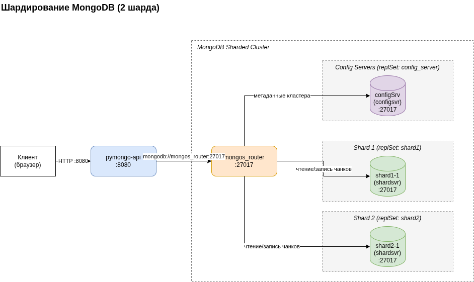

# pymongo-api + MongoDB Sharding

Первый вариант целевой схемы: приложение `pymongo-api` работает с шардированным кластером MongoDB
через роутер `mongos`. Коллекция `somedb.helloDoc` распределена между двумя шардами.

Схема: [mongo-sharding.drawio](./mongo-sharding.drawio)



## Состав сервисов

| Сервис | Тип | Назначение |
|---|---|---|
| `pymongo_api` | приложение (FastAPI) | HTTP API, порт `8080` |
| `mongos_router` | mongos | точка входа в кластер, порт `27017` |
| `configSrv` | configsvr, replSet `config_server` | метаданные кластера и карта чанков |
| `shard1-1` | shardsvr, replSet `shard1` | шард 1 |
| `shard2-1` | shardsvr, replSet `shard2` | шард 2 |

## Как запустить

```shell
docker compose up -d
```

## Инициализация шардирования

Для инициализации шардирования выполните шаги описанные ниже

Важно: `mongod` внутри контейнера поднимается не мгновенно,
поэтому перед шагом 1 дождитесь, пока все сервисы станут `healthy`:

```shell
docker compose ps
```

Если выполнять шаги на ещё не поднявшемся контейнере, `mongosh` ответит
`MongoNetworkError: connect ECONNREFUSED 127.0.0.1:27017`.

### 1. Инициализируем config-сервера

```shell
docker compose exec -T configSrv mongosh --port 27017 --quiet << 'EOF'
rs.initiate({
  _id: "config_server",
  configsvr: true,
  members: [{ _id: 0, host: "configSrv:27017" }]
});
EOF
```

### 2. Инициализируем replica set каждого шарда

На shard1-1

```shell
docker compose exec -T shard1-1 mongosh --port 27017 --quiet <<'EOF'
rs.initiate({
  _id: "shard1",
  members: [{ _id: 0, host: "shard1-1:27017" }]
});
EOF
```

На shard2-1

```shell
docker compose exec -T shard2-1 mongosh --port 27017 --quiet <<'EOF'
rs.initiate({
  _id: "shard2",
  members: [{ _id: 0, host: "shard2-1:27017" }]
});
EOF
```


### 3. Добавляем шарды в кластер (на `mongos_router`)

```shell
docker compose exec -T mongos_router mongosh --port 27017 --quiet <<'EOF'
sh.addShard("shard1/shard1-1:27017");
sh.addShard("shard2/shard2-1:27017");
EOF
```

### 4. Включаем шардирование БД и коллекции

```shell
docker compose exec -T mongos_router mongosh --port 27017 --quiet <<'EOF'
sh.enableSharding("somedb");
sh.shardCollection("somedb.helloDoc", { name: "hashed" });
EOF
```

При повторном выполнении шагов 1–2 MongoDB ответит `MongoServerError[AlreadyInitialized]:
already initialized`, а шаг 3 — ошибкой о дубликате шарда. Это нормально: значит кластер
уже собран, и эти шаги нужно просто пропустить.

### 5. Наполняем данными

```shell
docker compose exec -T mongos_router mongosh --port 27017 --quiet <<'EOF'
use somedb
for (var i = 0; i < 1000; i++) db.helloDoc.insertOne({ age: i, name: "ly" + i });
print("Всего документов: " + db.helloDoc.countDocuments());
EOF
```

## Как проверить

Распределение документов по шардам:

```shell
docker compose exec -T mongos_router mongosh --port 27017 --quiet <<'EOF'
use somedb
db.helloDoc.getShardDistribution();
EOF
```

Статус кластера:

```shell
docker compose exec -T mongos_router mongosh  --port 27017 --quiet --eval 'sh.status()'
```

Через приложение — в ответе корневого эндпоинта должны быть
`"mongo_topology_type": "Sharded"` и список шардов:

```shell
curl -s http://localhost:8080/ | jq
curl -s http://localhost:8080/helloDoc/count
```

### Если вы запускаете проект на локальной машине

Откройте в браузере http://localhost:8080

## Доступные эндпоинты

Список доступных эндпоинтов, swagger: http://localhost:8080/docs
